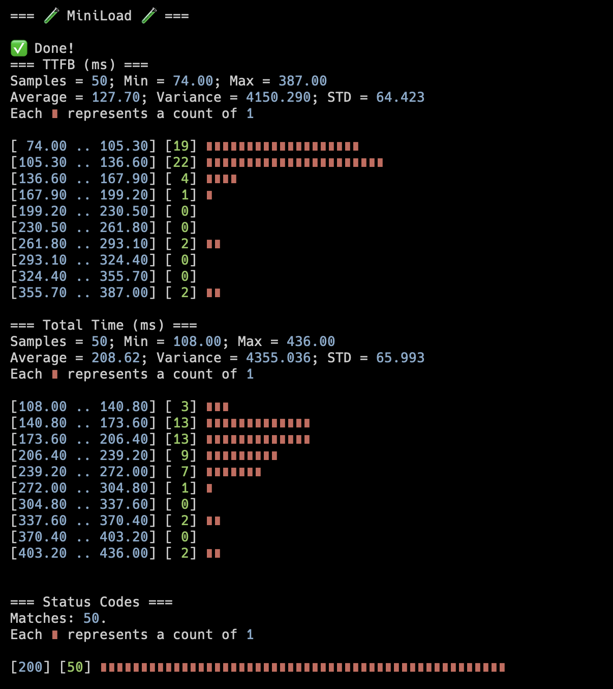

## miniload

🦀 Rust implementation of: https://codingchallenges.fyi/challenges/challenge-load-tester

### Usage

```
Usage: miniload [OPTIONS] --url <URL> --num-requests <NUM_REQUESTS>

Options:
  -u, --url <URL>
  -n, --num-requests <NUM_REQUESTS>
  -c, --concurrency <CONCURRENCY>
  -h, --help                         Print help
  -V, --version                      Print version
```

📷


